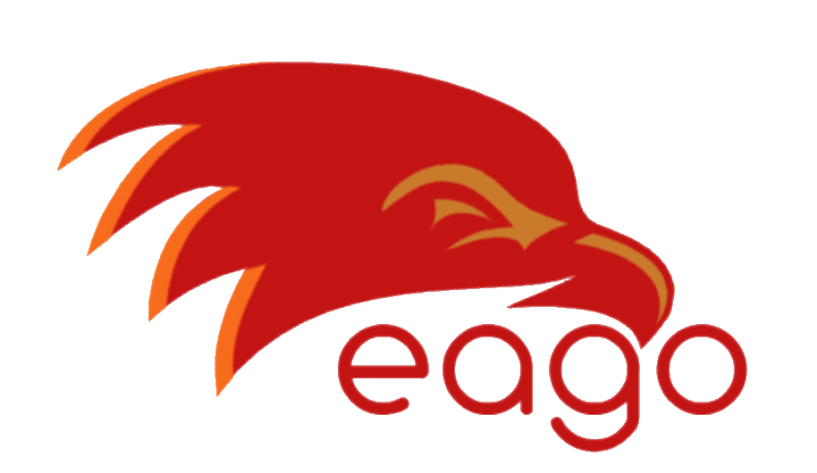

<p align="center">
  <a ">
    
  </a>
</p>

<h1 align="center">Eago</h1>

<div align="center">
 
</div>
<div align="center">
  <strong>Develop, Test and Deploy</strong>
</div>
<div align="center">
  A <code> JavaScript</code> runtime for developing maintainable web apps.
</div>
<br>

<div align="center">

<a href="https://circleci.com/gh/ahmetcanozcan/eago"> 

</a>

<a>

</a>

<a href="https://goreportcard.com/report/github.com/ahmetcanozcan/eago">

</a>

</div>
<br>
<br>

## Features

- Clean, synchronous javascript code (no callbacks, no promisses, no async/awaits)
- Maintainable project structre
- Native deployment support

## Install

Eago can be installed using go toolchain

```bash
$ go get github.com/ahmetcanozcan/eago
```

## Getting Started

Firstly create a project

```
$ eago new project <project_name>
$ cd <project_name>
```

After coding a basic handler, the App will be ready to start

```
$ echo "response.write('HELLO WORLD');" >> handlers/index.get.js
$ eago start
```
