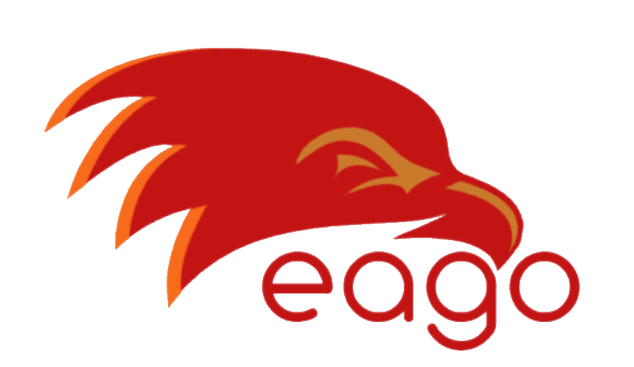

  

<h1 align="center">Eago</h1>

 

  <strong>Develop, Test and Deploy</strong>

  A <code> JavaScript</code> runtime for developing maintainable web apps.

 

 
 

## What is this

Eago is a javascript runtime built with Golang. Unlike other runtimes, Eago no needs for an event loop to execute async tasks. It uses Golang's concurrent features and design patterns. This is not the only difference, Eago has a lot of features for more maintainable web development

See guides for more detail

## Features

- Clean, synchronous javascript code (no callbacks, no promisses, no async/awaits)
- Maintainable project development
- Fast binary modules for web development

## Examples

Check out the [examples](https://github.com/ahmetcanozcan/eago/tree/master/examples/app) to see eago in use
